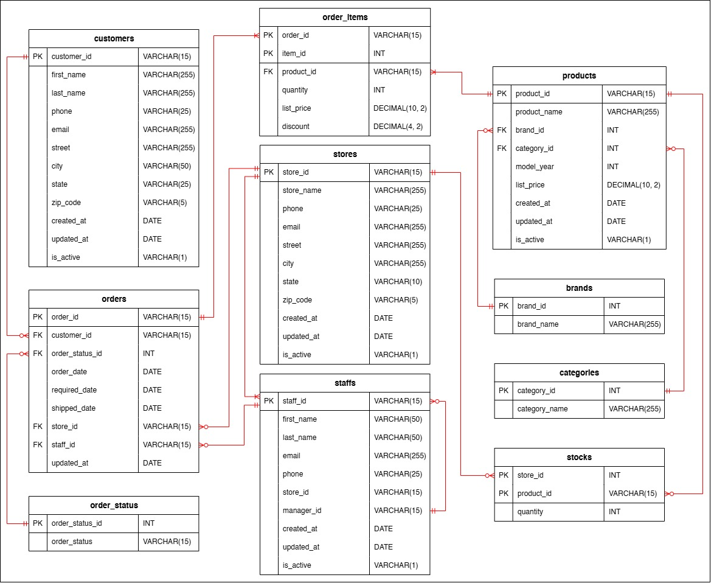

# 🚀 Data Pipeline Using AWS Services and Apache Airflow

This project leverages fundamental knowledge learned from various data engineering courses to build an end-to-end data pipeline that automates the ETL process for further analysis and reporting.

## 📑 Table of Contents

- [✨ Overview](#overview)

- [🏗️ Architecture](#architecture)

- [🗂️ Data Model](#data-model)

- [🌟 Airflow DAG](#airflow-dag)

- [⚙️ Setup](#setup)

- [📊 Dashboard Summary](#dashboard-summary)

## ✨ Overview

The project is designed to automate daily extraction of bike store transactional data. The data is then transformed by dropping duplicates and null values, extracting date components and structuring it into fact and dimension tables, aligned with a star schema in AWS Redshift. This approach optimizes performance for analysis in Power BI. The dashboard visualizes sales, products and customers data over a 2-year period from 2016 to 2018.

### Objectives

- Automate data ETL pipeline using AWS and Apache Airflow.
- Develop dimensional data model to support querying and reporting.
- Develop a comprehensive dashboard offering sections for sales, product and customer.

## 🏗️ Architecture

1. **Data Extraction:** Starting with data source, we use `Amazon RDS` with `PostgreSQL` engine as a source database. Extraction is performed using `SQL` to query against our database where we have `aws_s3 extension` installed.

2. **Data Storage:** Once we have our desired data extracted, we use `Amazon S3` buckets as staging area to store raw data before the transformation.

3. **Data Transformation:** Next, we read data from raw data bucket using `Apache Spark` running on `Amazon EMR Serverless` to clean and transform data. The processed data is then written back to S3 bucket.

4. **Data Warehousing:** Using `Amazon Redshift Serverless` as data warehouse to store processed data in dimensional model structure. The `COPY` command is used to load data from S3 to Redshift.

5. **Data Visualization:** As business intelligence layer, we use `Power BI` to create dashboard and visualize data from data warehouse.

6. **Pipeline Orchestration:** `Apache Airflow` running on `Amazon EC2` instance is used to automate the data pipeline. Airflow DAG manage and schedule tasks to run daily.

7. **Access Control:** We use `AWS IAM` to manage access and permissions. Roles and policies are configured to control permissions for accessing AWS services.


*Pipeline Architecture*

## 🗂️ Data Model

The dataset used in this project is publicly available from [here](https://www.kaggle.com/datasets/dillonmyrick/bike-store-sample-database).

1. **Data Source**

    Source database structured as relational data model as shown in link provided above. Data consists of bike stores transactional data in the United States. For this project, we have modified some parts in original dataset including:
    - Created lookup table for order status from orders table.
    - Added audit columns such as `created_at`, `updated_at` and `is_active` in customers, staffs, products, stores and orders tables to support incremental data loading in extraction process.
    - Setup database triggers on tables to automatically update audit columns upon record insertion or update.
    - Established soft deletion policy using database rules to mark records as inactive rather than deleting them directly.

    

    *Database Model*

2. **Data Destination**

    AWS Redshift Serverless is used as a destination for our data, it consists of 2 layers separated by database schemas.

    - **Staging Layer:** This schema temporarily holds data loaded from the S3 bucket using `COPY` command. The staging tables allow for data comparisons with existing records in the serving layer to identify new or updated records. After records are moved into the serving layer, this layer is cleared.

    

    *Data Warehouse Staging Tables*

    - **Serving Layer:** This layer structured as star schema, a dimensional data model, to leverage denormalized approach for read-optimized. Fact table contains measureable values, while dimension tables provide context. Once data is loaded into the staging layer, we use SQL scripts to compare data between layers to ensure that only new or modified data is inserted or updated.

    

    *Data Warehouse Model*

## 🌟 Airflow DAG

2 DAGs are included in this project, 1 DAG to setup environment and 1 DAG for our pipeline.

- **Setup DAG:** This DAG modifies our original dataset as we mentioned in Data Model section. It then creates schemas and tables in database and imports the modified dataset into the database. After that, the DAG setup database trigger and create required schemas and tables in data warehouse.

    

    *Setup DAG*

- **Pipeline DAG:** This is the main DAG to run ETL process where tasks are organized by their respective roles. Start from determining reference dates for extraction. For incremental load, we use last successful execution date as starting point and current execution date as endpoint. If there is no prior successful execution, DAG defaults to a full load starting from January 1, 2016. This design enables a full load on the first run, followed by incremental load in subsequent runs. After setting our reference dates, DAG proceeds with ETL tasks.

    

    *Pipeline DAG*

To start pipeline, `Setup DAG` must be run **manually** to prepare necessary resources. Once the setup is completed, `Pipeline DAG` is set to run **automatically** according to its schedule.

## ⚙️ Setup

1. **Amazon S3**

    We need to create 4 buckets.

    - `source_bucket` to store necessary project files.
    - `log_bucket` to store logs from Amazon EMR Serverless applications and Apache Airflow.
    - `raw_bucket` to store raw data from extraction process.
    - `processed_bucket` to store processed data from transformation process.

    Some buckets need to have folder structures created as follows:

    ```
    source_bucket
    ├───dataset
    │   ├───brands.csv
    │   ├───categories.csv
    │   ├───customers.csv
    │   ├───order_items.csv
    │   ├───orders.csv
    │   ├───products.csv
    │   ├───staffs.csv
    │   ├───stocks.csv
    │   └───stores.csv
    ├───ec2
    │   └───requirements.txt
    └───script
        └───spark_job.py
    ```

    Files in `dataset` folder can be downloaded from the link.

    ```
    log_bucket
    ├───airflow-log
    └───emr-log
    ```

2. **Amazon RDS**

    Using `PostgreSQL` engine with public access enabled. Necessary security group and IAM roles are listed as follows.
    
    - **Security Group**

        - Add `inbound` rule type `PostgreSQL` with port range `5432`.

    - **IAM Role**

        | Role        | Policy        | Resource           | Action                    |
        |-------------|---------------|--------------------|---------------------------|
        | Import Role | Import Policy | S3 `source_bucket` | `s3:GetObject`            |
        |             |               |                    | `s3:ListBucket`           |
        | Export Role | Export Policy | S3 `raw_bucket`    | `s3:PutObject`            |
        |             |               |                    | `s3:AbortMultipartUpload` |

3. **Amazon EMR Serverless**

    Requirement for setting up EMR Serverless is creating an IAM role with necessary permissions for running spark job and writing logs.

    - **IAM Role**

        | Role             | Policy             | Resource                                                           | Action          |
        |------------------|--------------------|--------------------------------------------------------------------|-----------------|
        | EMR Runtime Role | EMR Runtime Policy | S3 `source_bucket`, `log_bucket`, `raw_bucket`, `processed_bucket` | `s3:PutObject`  |
        |                  |                    |                                                                    | `s3:GetObject`  |
        |                  |                    |                                                                    | `s3:ListBucket` |

4. **Amazon Redshift Serverless**

    For compute resource, we use `8 RPUs` for the serverless workgroup. Necessary security group and IAM role are listed as follows.

    - **Security Group**

        - Add `inbound` rule type `Redshift` with port range `5439`.

    - **IAM Role**

        | Role                 | Policy                                       | Resource              | Action                 |
        |----------------------|----------------------------------------------|-----------------------|------------------------|
        | Redshift Access Role | S3 Access Policy                             | S3 `processed_bucket` | `s3:GetObject`         |
        |                      |                                              |                       | `s3:GetBucketLocation` |
        |                      |                                              |                       | `s3:ListBucket`        |
        |                      | `AmazonRedshiftAllCommandsFullAccess` Policy | AWS Managed Policy    | AWS Managed Policy     |

5. **Amazon EC2**

    EC2 instance specifications are

    ```
    Ubuntu OS
    t3a.medium Instance Type
    2 vCPU, 4 GiB Memory
    8 GiB Storage
    ```

    Also create `key pair` to connect to your instance.

    - **Security Group**

        - Add `inbound` rule type `SSH` with port range `22`.
        - Add `inbound` rule type `Custom TCP` with port range `8080` (for Apache Airflow).

    - **IAM Role**

        | Role     | Policy           | Resource                                    | Action                        |
        |----------|------------------|---------------------------------------------|-------------------------------|
        | EC2 Role | EMR policy       | Any EMR Serverless applications and jobruns | All EMR Serverless actions    |
        |          | IAM Policy       | Any role                                    | `iam:PassRole`                |
        |          |                  |                                             | `iam:CreateServiceLinkedRole` |
        |          | S3 Access Policy | S3 `source_bucket`, `log_bucket`            | `s3:PutObject`                |
        |          |                  |                                             | `s3:GetObject`                |
        |          |                  |                                             | `s3:ListBucket`               |

    Setup EC2 instance for Airflow by running commands in `ec2_setup.sh`. Once Airflow starts running, we can connect to web UI by navigate to `<EC2-public-IPv4-address>:8080` in browser.

## 📊 Dashboard Summary

Full dashboard file located in `dashboard` folder

- Sales trends have decreased over the past 6 months, starting from June 2018. This includes revenue, orders and units sold. Company should prioritize this issue, as it represents a significant drop after the peak in April 2018.

- Orders tend to have longer delivery time than expected, leading to late delivery issue. This could impact customer satisfaction, as late deliveries account for 20-30% of total orders in each store.

- Prioritize top-selling products like Trek Slash 8 27.5 - 2016, as it generates outstanding revenue compared to others and has a high level of demand. In terms of brand performance, Trek and Electra are the top 2, leading in both revenue and customer demand.

- 14 products are underperformance with 0 units sold, Company should consider removing them from the store to help reduce inventory costs.

- Most customers live in New York, where 9 out of the top 10 spenders are located. This related to store performance, with New York branch having the highest sale, while Texas branch has the lowest.